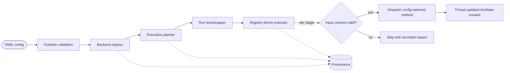

<div align="center">

# CellQuorum

**A publication-grade, config-driven single-cell RNA-seq workflow engine.**

*One configuration file. One command. A validated, reproducible, provenance-tracked analysis — on CPU or GPU, in Python and R.*

[](https://github.com/SecondBook5/cellquorum/actions/workflows/ci.yml)


</div>

---

## START HERE

**Want to run an analysis?** You drive CellQuorum entirely from a config file and the
CLI — no need to read the source. See **[Getting started](#getting-started)** and the
hands-on **[tutorial](docs/tutorial.md)**.

**Want to read or modify the code?** Begin with these files (paths below are under
`src/cellquorum/`):

1. **Entry point:** The CLI lives in `cli/app.py` — look for the `main()` function that launches the `cellquorum` / `cq` command. The programmatic API lives in `api/pipeline.py` — `run_pipeline` is the main Python entry point.

2. **Run flow:** Read `docs/how-it-works.md` for a complete file-by-file walkthrough of one run: config validation → backend detection → planning → data loading → stage execution → provenance. It names every file on the control-flow spine.

3. **Configuration:** The `config/models.py` file defines the entire configuration schema as Pydantic models — `CellQuorumConfig` is the top-level contract. See `docs/configuration.md` for a section-by-section reference.

4. **Architecture:** `docs/architecture.md` explains the design principles, the execution model, and how the pieces fit together.

**One-line run trace:** `cli/app.py:main` → validate config (`config/models.py`) → build plan (`core/planner.py` reads `core/stage_catalog.py`) → load data (`io/manifest.py`) → execute stages (`core/executor.py` dispatches to `stages/<stage>/stage.py`, writes via `core/stage_artifact_writer.py`) → final context with annotated `adata`.

---

## Overview

CellQuorum turns an advanced single-cell RNA-seq analysis into a **single validated
configuration file** and **one command**. It handles pairwise, factorial, and
single-sample designs; you describe the dataset and the analysis in YAML, and the
engine plans, validates, and executes the workflow — threading one `AnnData` object
through every stage and recording exactly what it did.

The engine pairs an **execution spine** (strict configuration validation, backend
detection, planning, provenance) with a **config-driven analysis backbone** of
**32 stages** and **~60 selectable methods**, spanning quality control through
gene-regulatory networks, cell-cell communication, and trajectory inference. Stages
dispatch to Python, R/Bioconductor, or GPU backends transparently, and every stage
boundary is guarded by **fail-loud data contracts** — a method whose inputs are
missing *skips with a recorded reason* rather than crashing or silently emitting
wrong results.

> **Design principle — no silent wrong answers.** Configuration is validated before
> anything runs, data contracts are checked at every stage boundary, and skips,
> failures, and never-run stages are recorded distinctly in machine-readable
> provenance. If a result cannot be trusted, the run tells you.

## Highlights

- **Config over code.** Every method is chosen in YAML (`integration.method: harmony | scvi`), so a dataset is expressed as configuration, not a script.
- **32 stages, ~60 methods.** A best-practices pipeline from ambient correction to trajectory, each stage offering config-selectable methods.
- **GPU by default, when available.** Normalization, PCA, neighbors, and Leiden route onto `rapids-singlecell`/`cupy` when a capable CUDA device is present, and fall back to scanpy (CPU) otherwise — with identical output keys either way.
- **Python + R, transparently.** R/Bioconductor methods (edgeR, Milo, propeller, NicheNet, DIALOGUE, SoupX, hdWGCNA) and isolated heavyweight backends (pySCENIC, scCODA, CellOracle) are dispatched behind one interface.
- **Fail-loud data contracts.** Structural, layer-provenance, and statistical checks reject, for example, raw counts mislabeled as log-normalized.
- **Reproducible & auditable.** A standardized run directory plus machine-readable provenance (resolved config, plan, backend status, environment/version stamp, artifact manifest).
- **Two front doors.** A `cellquorum` / `cq` CLI and a `run_pipeline` Python API.

## Workflow

A run validates the config, plans the enabled stages against detected backends,
bootstraps the run directory, then executes each enabled stage in canonical order,
propagating the updated `AnnData` downstream:

<p align="center">
  
</p>

*The diagram is generated from the stage registry (`docs/assets/gen_pipeline_diagram.py`),
so it always matches the engine: a shared preprocessing → integration → annotation
backbone produces one annotated object, then the four downstream analysis families
fan out in parallel and converge on the run directory. Each stage row names its
config-selectable methods, and reserved (not-yet-implemented) stages appear as muted
rows. A stage also skips cleanly when disabled in the config or when its required
inputs or backends are unavailable.*

## Installation

CellQuorum targets Python 3.12–3.14. From a clone:

```bash
git clone https://github.com/SecondBook5/cellquorum.git
cd cellquorum

# create an environment (conda/mamba/micromamba recommended)
mamba create -n cellquorum-dev python=3.12 -y
mamba activate cellquorum-dev

# install the package (with dev extras) in editable mode
python -m pip install -e ".[dev]"

# optional: install pre-commit hooks
pre-commit install
```

Optional extras: `.[r]` (rpy2 bridge for R/Bioconductor methods), `.[gpu]`
(scvi-tools). The heavyweight and GPU stacks (RAPIDS, pySCENIC, scCODA, CellOracle,
hdWGCNA) live in dedicated environments — see [Backends & environments](#backends--environments)
and [`envs/README.md`](envs/README.md). A layered Docker image bakes all of them;
see [`docs/docker.md`](docs/docker.md).

## Getting started

**New here? Work through the [hands-on tutorial](docs/tutorial.md).** It takes you
from a raw `.h5ad` to a finished, provenance-tracked run in five steps:

1. Copy the shipped example — `cp configs/generic_pbmc_example.yaml configs/my_run.yaml`
2. Point `input.h5ad` at your data and set your `cohort:` / `design:` obs columns
3. Preview — `cellquorum plan -c configs/my_run.yaml`
4. Execute — `cellquorum run -c configs/my_run.yaml -o runs/my_run`
5. Read `runs/my_run/reports/` first, then `figures/` and `results/`

The command reference below is the quick lookup once you have a config.

## Quickstart

```bash
# 1. inspect the execution plan for a config (which stages run, on which backends)
cellquorum plan --config configs/config.yaml

# 2. run the full pipeline into a run directory
cellquorum run --config configs/config.yaml --output-dir runs/example_run

# initialize the run directory + provenance without executing stages
cellquorum run --config configs/config.yaml --output-dir runs/example_run --bootstrap-only

# machine-readable output for either command
cellquorum plan --config configs/config.yaml --json
```

`cellquorum run` validates the config, writes provenance, then executes every
enabled stage, threading the `AnnData` object from stage to stage and recording a
structured success / skip / failure for each.

## Configuration

A dataset and its analysis are described entirely in YAML and validated by a strict
Pydantic schema (`extra = "forbid"` — unknown keys are rejected). The top-level
sections:

| Section | Configures |
|---|---|
| `project` | name, organism, `species_id` |
| `paths` | `data_root`, `run_root`, `scratch_root`, manifest, `output_dir` |
| `input` | input `.h5ad` path, counts layer, optional subset |
| `run` | profile, `run_id`, `random_seed`, `resume`, overwrite, logging |
| `compute` | `backend` (`auto`/`cpu`/`gpu`), `prefer_gpu`, `fallback_to_cpu`, `n_jobs` |
| `r` | R/Rscript backend preference, `rscript_path`, timeout |
| `report` | HTML / Markdown / PDF report toggles |
| `stages` | per-stage enable flags |
| *per-stage blocks* | one block per stage (e.g. `integration:`, `enrichment:`) selecting the method and its parameters |
| `markers`, `cohort`, `design`, `contrasts` | marker panels, obs-key schema, experimental design, named case/control contrasts |

Every section has defaults, so a minimal config is small. A method is chosen per
stage with a `method:` (or `methods:`) key inside that stage's block:

```yaml
project:
  name: cellquorum_project
  organism: human
  species_id: 9606

compute:
  backend: auto        # prefer GPU when a capable device is present, else CPU
  prefer_gpu: true
  fallback_to_cpu: true

stages:                # enable/disable stages (all default true except
  qc: true             # ambient_correction and integration_gate)
  preprocessing: true
  dimensionality: true
  integration: true
  clustering: true
  annotation: true
  differential_expression: true
  differential_abundance: true
  enrichment: true

integration:
  method: harmony      # or: scvi

differential_abundance:
  method: milo         # or: sccoda | propeller | proportion_ttest
```

See [`docs/configuration.md`](docs/configuration.md) for the full section-by-section
reference, `configs/generic_pbmc_example.yaml` for a runnable single-object example
(point `input.h5ad` at your data), and `configs/config.yaml` for the reference
configuration.

## Analysis stages

Each stage validates its input contract, dispatches to the config-selected method,
and records the outcome. Stages marked *isolated env* run as subprocesses in a
dedicated environment; *R* methods run over the Rscript/rpy2 bridge.

| Stage | Methods | Backend |
|---|---|---|
| `ambient_correction` | SoupX | R |
| `qc` | MAD/fixed thresholds; Scrublet + scDblFinder doublet consensus; Tirosh cell-cycle | Python (+R) |
| `preprocessing` | PFlog1pPF / log1p-CP10k normalization (layer-tagged) | Python · GPU |
| `feature_selection` | HVG; Seurat v3; Pearson-residuals/deviance | Python |
| `dimensionality` | PCA + scree + `n_pcs: auto` (knee, logged) | Python · GPU |
| `integration` | Harmony (CPU); scVI (GPU-gated) | Python · GPU |
| `clustering` | Leiden + neighbors on the integrated embedding | Python · GPU |
| `subclustering` | recursive Leiden with sc-SHC significance | Python |
| `annotation` (+ consensus, diagnostics, adjudication) | marker-vote; CellTypist; passthrough; scDiagnostics | Python (+R) |
| `reference_mapping` | scArches (atlas-agnostic) | Python |
| `integration_benchmark` | scIB-style metrics | Python |
| `population_identity` | population-level identity scoring | Python |
| `state_scoring` | curated cell-state program scoring — scanpy `score_genes` + decoupler AUCell (stress/HSP, hypoxia, IFN, senescence, fibrosis) | Python |
| `discovery` | de-novo program discovery — consensus NMF (replicate fits + KMeans consensus spectra, cNMF-style) | Python |
| `embeddings` | UMAP + PHATE + PAGA (incl. PAGA-on-UMAP); feature/score overlays with opt-in MAGIC | Python |
| `differential_expression` (+ `de_viz`) | donor-aware pseudobulk (edgeR); volcano | R |
| `differential_abundance` | paired arcsin-sqrt t-test; Milo; scCODA; propeller | Python + R + isolated env |
| `enrichment` (+ `enrichment_viz`) | GSEA; ORA; GSVA; decoupler activity (CollecTRI/PROGENy) | Python |
| `coexpression` | hdWGCNA co-expression modules | isolated R env |
| `grn` | pySCENIC regulons (GRNBoost2 → cisTarget → AUCell) | isolated env |
| `perturbation` | CellOracle in-silico TF knockouts (ranked target table) | isolated env |
| `cell_cell_communication` | LIANA consensus; Tensor-cell2cell; NicheNet + MultiNicheNet | Python + R |
| `multicellular_programs` | DIALOGUE cross-cell-type coordinated programs | R |
| `ccc_network` | topology (roles + PageRank); Ollivier-Ricci curvature | Python |
| `ccc_viz` | dotplot / chord / Sankey / curvature-network / summary | Python |
| `trajectory` (+ `trajectory_viz`) | scVelo RNA velocity per lineage (velocyto loom ingestion) | Python |

Three further slots (`integration_gate`, `composition`, `molecular_inference`) are
reserved in the planner and skip as *not yet implemented*.

## Backends & environments

CellQuorum uses layered environments to isolate incompatible dependency stacks.
Backend availability is detected at runtime and reported in provenance; an absent
backend causes the affected method to skip with a reason, never to crash the run.

**Primary environments:** `cellquorum-core` (main runtime + CLI), `cellquorum-dev`
(adds test/lint/build tooling), `cellquorum-gpu` (CUDA PyTorch + scvi-tools + RAPIDS),
`cellquorum-r` (Seurat, zellkonverter, rpy2, anndata2ri).

**Isolated backend environments** (invoked as subprocesses; names are hardcoded in
the dispatch code, so create them exactly as named):

| Environment | Powers | Why isolated |
|---|---|---|
| `pyscenic_env` | `grn` (pySCENIC) | pins `numpy`/`pandas`/`setuptools` incompatible with the core stack |
| `hdwgcna_env` | `coexpression` (hdWGCNA) | R + Seurat/WGCNA stack |
| `sccoda_env` | `differential_abundance` (scCODA) | older scipy/tensorflow pins |
| `celloracle_env` | `perturbation` (CellOracle) | dependency isolation for reproducibility |
| `scclr` | `preprocessing`/`dimensionality` (sparse PFlog1pPF + PCA) | pins `anndata<0.11`, Python ≤ 3.13 |

R/Bioconductor methods (edgeR, Milo, propeller, NicheNet, MultiNicheNet, DIALOGUE,
scDiagnostics) run over the Rscript/rpy2 bridge through one shared abstraction
(`cellquorum.methods.r_method.RAnalysisMethod`). See
[`docs/backends.md`](docs/backends.md) and [`envs/README.md`](envs/README.md) for
setup and `make lock` for pinned environments.

## GPU acceleration

Normalization (PFlog1pPF via cupy), PCA, and neighbors + Leiden (via
`rapids-singlecell`) run on the GPU when `rapids-singlecell` + `cupy` are installed
and a CUDA device is present, and fall back to scanpy on CPU otherwise. A shared
compute router gates on **real capability** — not merely a visible device — and
routed methods produce identical output keys on both paths, so results and data
contracts are path-independent. Set `compute.backend: cpu` to force CPU.

## Reproducibility & provenance

Before analysis begins, CellQuorum writes machine-readable provenance into
`<run>/provenance/`:

| File | Purpose |
|---|---|
| `resolved_config.json` | the validated, fully-resolved runtime configuration |
| `pipeline_plan.json` / `stage_plan.csv` | enabled / skipped / unimplemented stage plan |
| `backend_status.json` / `.csv` | detected backend availability |
| `planner_warnings.json` | planner warnings |
| `run_metadata.json` | run identity, paths, profile, seed, environment/version stamp |
| `artifact_manifest.csv` | index of every generated artifact |

A run directory has a fixed layout:

```text
runs/example_run/
├── figures/      ├── objects/      ├── reports/      ├── results/
├── logs/         ├── provenance/   └── scratch/
```

Opt-in resume (`run.resume: true`) skips a side-effect-only stage whose prior
completion fingerprint matches the current input and whose artifacts still exist.

## Python API

```python
from cellquorum import run_pipeline

result = run_pipeline(
    config="configs/config.yaml",     # path, dict, or CellQuorumConfig
    output_dir="runs/example_run",
)

print(result.context.paths.root)           # the run directory
print(result.plan.enabled_stage_names())   # stages the plan enabled

# execution_result is populated when execute=True (the default)
if result.execution_result is not None:
    print(result.execution_result.succeeded_stage_names())
    print(result.execution_result.skipped_stage_names())
```

`run_pipeline` accepts a YAML config path, a validated `CellQuorumConfig`, or a
plain `dict`, and returns a `PipelineRunResult` with `config`, `plan`, `context`,
`artifacts`, and (for executed runs) `execution_result`.

## CLI reference

The `cellquorum` (alias `cq`) command exposes:

| Command | Purpose | Key options |
|---|---|---|
| `cellquorum --version` | print the installed version | |
| `cellquorum plan` | build and display the execution plan | `--config/-c`, `--json` |
| `cellquorum run` | execute a pipeline run | `--config/-c`, `--output-dir/-o`, `--bootstrap-only`, `--json`, `--quiet/-q` |

A separate `gen-configs run` command expands a hypothesis manifest into
per-`(hypothesis, cell_type)` configs plus an accounting file:

```bash
gen-configs run --manifest hypotheses.yaml --template template.yaml --out-dir generated/
```

## Architecture



The source is organized into **10 top-level packages** under `src/cellquorum/`, with
the 12 pipeline-step packages grouped together under `stages/` — one canonical import
path per public thing, no compatibility shims (frozen by
`tests/test_old_paths_removed.py`). The engine machinery is `core` (context, planner,
executor, contracts, provenance), `config`, `methods` (dispatch + shared
abstractions), and `backends`; `stages` holds the 12 step packages
(`ambient_correction`, `qc`, `preprocessing`, `clustering`, `integration`,
`annotation`, `comparative`, `state_scoring`, `discovery`, `gene_regulation`,
`cell_cell_communication`, `trajectory`) in run order; and `io`, `visualization`,
`api` (the public Python API surface), `cli`, and `utils` round out the public
surfaces. The `stages/comparative` package groups the four "compare groups" analyses
as submodules — `differential_expression`, `differential_abundance`, `enrichment`,
and `multicellular_programs`. See [`docs/architecture.md`](docs/architecture.md).

## Development

```bash
pytest                        # full test suite
pre-commit run --all-files    # ruff + hooks
cellquorum plan --config configs/config.yaml   # CLI smoke check
```

GPU-marked tests skip on CPU-only machines and run in `cellquorum-gpu`; R-marked
tests require an Rscript + Bioconductor backend. Markers: `gpu`, `slow`, `r`,
`integration`.

## Documentation

- [`docs/index.md`](docs/index.md) — documentation home
- [`docs/tutorial.md`](docs/tutorial.md) — hands-on first run, from a raw `.h5ad` to results
- [`docs/architecture.md`](docs/architecture.md) — engine design and execution model
- [`docs/configuration.md`](docs/configuration.md) — configuration reference
- [`docs/backends.md`](docs/backends.md) — backends and environments
- [`docs/docker.md`](docs/docker.md) · [`docs/snakemake.md`](docs/snakemake.md) — containerized and orchestrated runs
- [`docs/ROADMAP.md`](docs/ROADMAP.md) — roadmap and backlog
- [`CHANGELOG.md`](CHANGELOG.md)

## Citing

If you use CellQuorum in your research, please cite it using the metadata in
[`CITATION.cff`](CITATION.cff).

## License

BSD 3-Clause License. See [`LICENSE`](LICENSE).
