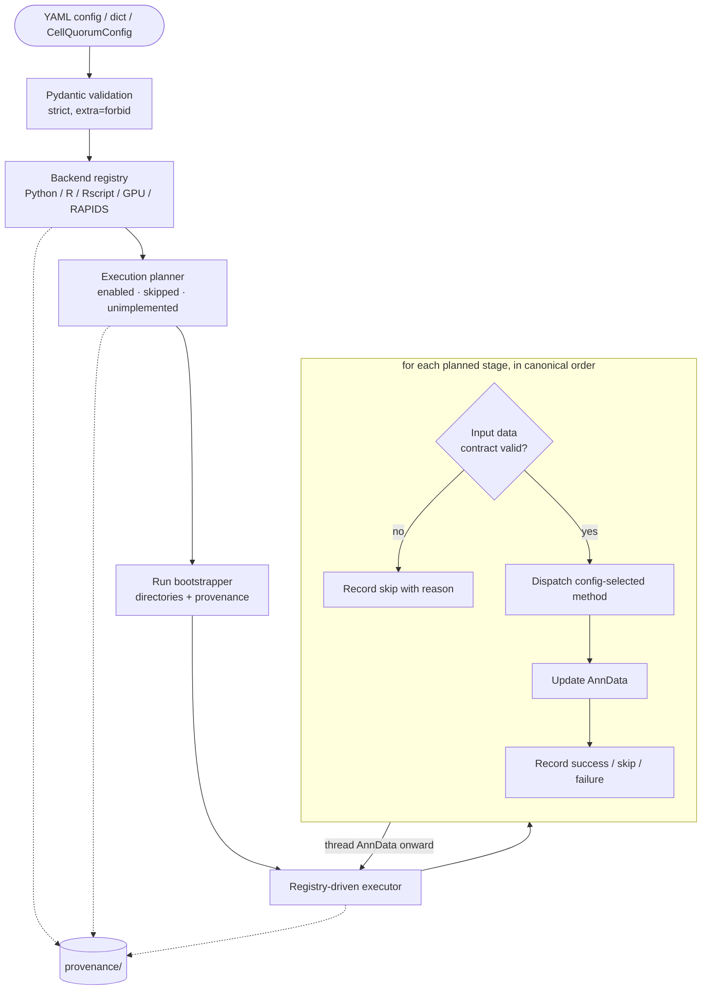

# Architecture

CellQuorum separates an **execution spine** — the machinery that turns a config into
a validated, planned, provenance-tracked run — from a **config-driven analysis
backbone** of stages that do the science. This document describes how a run flows
through the engine and how the source is organized.

## Execution model



1. **Validation.** A config (path, `dict`, or `CellQuorumConfig`) is parsed by a
   strict Pydantic schema. Unknown keys are rejected (`extra = "forbid"`), so typos
   fail loudly before any compute. The whole-config validator also rejects
   contradictory settings (e.g. `compute.backend: auto` with `fallback_to_cpu: false`).

2. **Backend detection.** The backend registry probes for Python, R/Rscript, GPU,
   and RAPIDS availability and produces a structured report. Detection gates on real
   capability, not merely a declared preference.

3. **Planning.** The planner walks the canonical stage order and, for each stage,
   marks it enabled (its `stages.*` flag is on and it is implemented), skipped
   (disabled), or unimplemented (a reserved slot). The plan is written to provenance
   before execution.

4. **Bootstrapping.** The run bootstrapper creates the standardized run directory
   and writes the resolved config, plan, backend status, run metadata (including an
   environment/version stamp), and an artifact manifest.

5. **Execution.** The registry-driven executor runs each enabled stage in order.
   For every stage it validates the input data contract, dispatches to the
   config-selected method, threads the updated `AnnData` to the next stage, and
   records a structured success, skip, or failure. A skipped or contract-failing
   stage leaves the `AnnData` unchanged and never aborts the run for a downstream
   stage that does not depend on it.

## Data contracts (fail-loud)

Every stage boundary is guarded by a data contract with three layers of checks:

- **Structural** — required layers, `obs` columns, and embeddings are present.
- **Layer-provenance** — layers carry semantic tags (e.g. "log-normalized"), so a
  stage cannot silently consume the wrong representation.
- **Statistical** — sanity checks such as rejecting raw counts that are mislabeled
  as log-normalized.

When a contract is not satisfied, the stage **skips with a recorded reason** rather
than crashing or producing wrong output. This is the core "no silent wrong answers"
guarantee.

## Method dispatch

Most analysis stages are `MethodDispatchStage`s: the stage reads a `method:` (or
`methods:`) key from its config block and dispatches to a registered
`AnalysisMethod`. Methods self-gate — an R method checks for Rscript and its R
packages; a GPU method checks for a capable device — and skip with a reason when
their backend is absent. This keeps method selection declarative (in YAML) and makes
backend availability a runtime concern rather than an install-time hard dependency.

R/Bioconductor methods share one abstraction, `cellquorum.methods.r_method.RAnalysisMethod`,
which centralizes Rscript resolution and R-package availability checks for the
edgeR, Milo, propeller, NicheNet, MultiNicheNet, and scDiagnostics adapters.

## Writing result artifacts

Every stage produces result files — a table of differential-expression statistics, a
JSON summary, an enrichment-score matrix. Each of those files has to land in the right
run folder *and* be recorded, so it shows up in the run's report and provenance
manifest instead of sitting loose on disk. `StageArtifactWriter`
(`core/stage_artifact_writer.py`) is the single helper that does both in one call.

A stage asks its run context for a writer, then tells the writer to write a table or a
JSON file. The writer puts the file in the correct folder, records it, and hands back a
`StageArtifact` — the small record (name, path, kind, description) the report and
provenance read from:

```python
# Before — hand-rolled: build the path, write the file, then describe it separately.
assignments_path = results_path / f"{key_added}_assignments.csv"
assignments.to_csv(assignments_path, index=False)
artifacts.append(
    StageArtifact(
        name="reference_mapping_assignments",
        path=assignments_path,
        kind="csv",
        description="Per-cell transferred labels and uncertainty scores.",
    )
)

# After — one call writes the file and records it.
writer = StageArtifactWriter.from_context(context)
artifacts.append(
    writer.table(
        assignments,
        f"{key_added}_assignments.csv",
        name="reference_mapping_assignments",
        description="Per-cell transferred labels and uncertainty scores.",
        index=False,
    )
)
```

Both forms write the exact same bytes to the exact same path — the writer is a tidier
way to say the same thing, not a change to where files go. Three methods cover the
cases a stage meets:

- **`writer.table(df, "name.csv", name=…, description=…)`** — write a DataFrame as CSV
  or Parquet (the format is read from the filename). The row index is dropped by
  default (`index=False`, matching the usual `to_csv(index=False)`); pass `index=True`
  only when the row labels are themselves data.
- **`writer.json(payload, "name.json", name=…, description=…)`** — write a dict or list
  as JSON (`indent=2, sort_keys=True`).
- **`writer.register(name=…, filename=…, kind=…, description=…)`** — record a file a
  specialized library *already* wrote (for example an `.h5ad` saved by
  `adata.write_h5ad`) without re-writing it, so it still appears in the report.

By default files go into the run's `results/` folder. Passing
`from_context(context, default_subdir="cell_cell_communication")` makes every
`table`/`json` call from that writer drop into a named subfolder, so a stage that
writes several files into one subdirectory sets the subfolder once instead of
repeating it on every call.

**Where the writer does *not* apply.** The writer is for a stage's own result files.
Four kinds of writes are deliberately left alone, because routing them through the
writer would change behavior rather than tidy it:

- **Scratch inputs handed to external tools.** Several R methods (and the
  CellOracle/pySCENIC subprocesses) write a temporary CSV into `scratch/`, run an
  external script that reads it, and read the result back. Those temp files are
  plumbing, not results — they belong in `scratch/`, never `results/`.
- **Files a library already wrote.** When a subprocess or library writes its own output
  (pySCENIC's regulon CSV, a CellRank estimator pickle, the deduplicated `.h5ad` from
  `trajectory/save.py`), the stage records it with `register(...)` — the tool owns that
  path, so the writer must not recompute or re-write it.
- **Figures.** Plots are saved by the shared figure helpers and recorded as
  `kind="figure"`. The writer is for tables and JSON, not images.
- **The QC stage's own writer.** `qc/artifacts.py` has a small
  `write_dataframe_artifact`/`write_json_artifact` facade that predates this one; QC is
  already centralized through it, so it is left as-is.

A contributor writing a new stage uses `StageArtifactWriter` for the tables and JSON
their stage computes, and reaches for `register(...)` only when an external tool wrote
the file.

## Compute routing

A shared compute router selects CPU or GPU execution for routed operations
(normalization, PCA, neighbors, Leiden). It gates on real capability
(`rapids-singlecell` + `cupy` importable and a CUDA device present), honors
`compute.backend`/`prefer_gpu`/`fallback_to_cpu`, and guarantees that routed methods
emit identical output keys on both paths, so downstream contracts and results are
path-independent.

## Resume

With `run.resume: true`, the executor computes a deterministic input fingerprint for
each stage (stage config + input `AnnData` signature + seed). A side-effect-only
stage whose prior completion marker matches the current fingerprint — and whose
recorded artifacts still exist — is skipped as "resumed". Resume is best-effort: any
failure in fingerprinting or the resume decision degrades to normal execution, never
to a broken run.

## Source layout

The package is organized into 20 top-level packages under `src/cellquorum/`:

| Package | Responsibility |
|---|---|
| `core` | pipeline context, planner, executor, data contracts, provenance, run reporting, resume/fingerprint |
| `config` | Pydantic models, loader, validation, cohort/design/markers schemas |
| `methods` | method dispatch base classes, the method registry, and shared abstractions (incl. `RAnalysisMethod`) |
| `backends` | backend registry + subprocess adapters (pySCENIC, scCODA, CellOracle, scclr) and bundled R scripts |
| `ambient_correction` | SoupX ambient-RNA correction stage (runs first, per library, before QC) |
| `qc` | quality control: metrics, thresholds, doublets, decisions, artifacts |
| `preprocessing` | normalization, feature selection, dimensionality reduction |
| `clustering` | clustering and recursive subclustering |
| `integration` | batch integration, embeddings, integration benchmark |
| `annotation` | annotation, consensus, diagnostics, adjudication, reference mapping, population identity |
| `differential_expression` | donor-aware pseudobulk DE and its visualization |
| `differential_abundance` | compositional/abundance testing |
| `enrichment` | GSEA/ORA/GSVA/decoupler and enrichment visualization |
| `gene_regulation` | co-expression (hdWGCNA), GRN (pySCENIC), perturbation (CellOracle) |
| `cell_cell_communication` | LIANA/Tensor-c2c/NicheNet, network topology + curvature, CCC visualization |
| `multicellular_programs` | cross-cell-type coordinated programs via DIALOGUE |
| `trajectory` | RNA velocity and trajectory visualization |
| `io` | input/output helpers |
| `visualization` | shared figure styling/plotting (`figstyle`) and QC figure builders (`visualization.qc`) |
| `cli` | the `cellquorum`/`cq` Typer app and the `gen-configs` workflow commands |

Each stage package follows a uniform layout — `stage.py` (the stage implementation),
`config.py` (its Pydantic block), and one method module per method — which keeps the
dispatch surface predictable across stages.

## Adding a stage

Every stage announces itself in one place: a `@register_stage(...)` decorator sitting
directly above its class in that stage's `stage.py`. That one decorator is the single
source of truth for the stage's identity — its stable `name`, its position in the run
(`order`), the config toggle that turns it on (`config_flag`), the config block it
reads (`config_field`), and its method-registry `category`. A central catalog
(`core/stage_catalog.py`) collects every registration; the **planner** reads it to
decide the run order and the **executor** reads it to build the set of runnable
stages. Neither keeps its own hand-written list, so a stage is never wired in two
places that can drift apart.

To add a new stage, a contributor touches four things — and no more:

1. **Write the stage package** — a new folder under `src/cellquorum/` with the usual
   `stage.py` / `config.py` / method modules (see *Source layout* above for the
   pattern to copy).
2. **Decorate the stage class** — put `@register_stage(name=..., order=...,
   config_flag=..., config_field=..., category=...)` immediately above the class in
   `stage.py`. Pick an `order` between the two neighbours it should run between
   (orders are spaced by 10 precisely so there is room to insert one).
3. **Add the two config fields** — a boolean on/off flag on `StageSelectionConfig`
   (matching `config_flag`) and the stage's settings sub-block on `CellQuorumConfig`
   (matching `config_field`), both in `config/models.py`. These stay explicit on
   purpose: they are the user-facing knobs, and keeping them spelled out makes the
   config self-documenting.
4. **Register the import** — add one `import cellquorum.<your_package>.stage` line to
   `core/stages.py`, in the canonical-order position, so the decorator actually runs
   when the engine starts.

`tests/test_stage_catalog.py` is the safety net: it fails loudly if a stage's flag or
config block is missing or orphaned, if two stages claim the same `order`, or if the
run order drifts from the frozen golden list. Run it (`pytest tests/test_stage_catalog.py`)
after adding a stage and it will tell you exactly which of the four steps is
incomplete.
